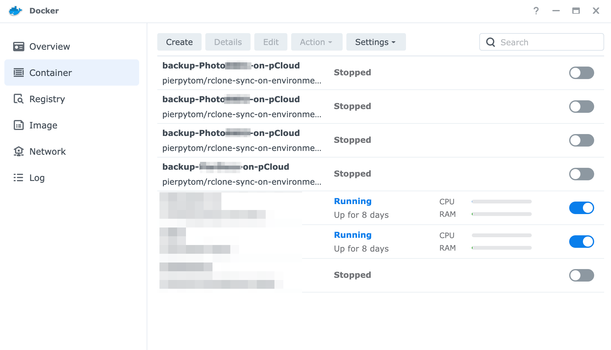
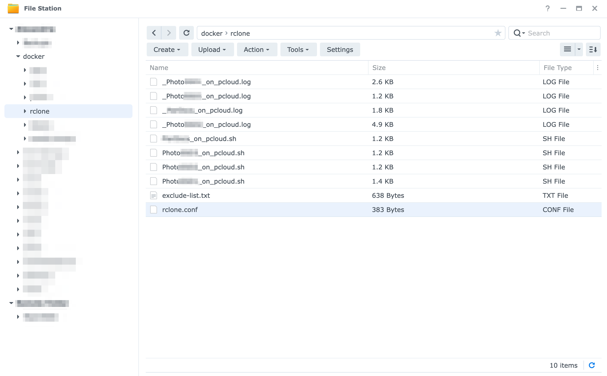
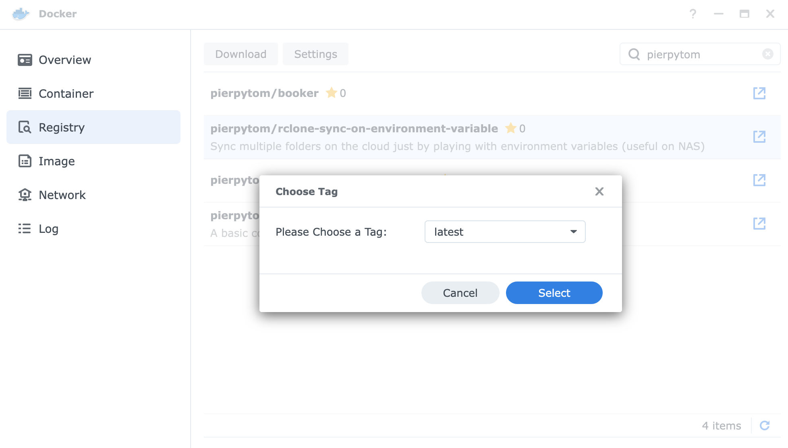
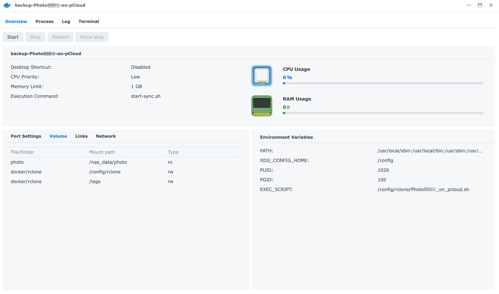

**rclone-sync-on-environment-variable**
> Sync multiple folders on the cloud just by playing with environment variables (useful on NAS)

This docker project simply extends [rclone docker image](https://hub.docker.com/r/rclone/rclone) to use a custom script specified in the environment variable when launched. That's it. This project requires you to be at least a bit familiar with [rclone](https://rclone.org/).

**But why?** I purchased the [pCloud](https://www.pcloud.com/) lifetime offer for 2TB, but I didn't consider how much of a terrible cloud it is. Their connection is _highly_ unreliable (e.g. WebDav is constantly disconnected, so HyperBackup on DSM won't work), their network speed is really slow (even if I was connected from one of the biggest data centers in EU), there is no good client for MacOS or Windows (if I recall correctly it's just some fuse wrapper) and so on. _pCloud might offer 2TB, but in reality it's really difficult to really use that space_. [rclone](https://rclone.org/) made up for all these shortcomings, proving itself a very reliable tool, and this project is just a bridge for a more direct and simplified usage (run it in the background, and then just check the result once finished).

Pre-built image of this project is [available on dockerhub](https://hub.docker.com/repository/docker/pierpytom/rclone-sync-on-environment-variable/general), you can simply pull `pierpytom/rclone-sync-on-environment-variable:latest`, but I'll go through the steps below.

What we will see in this document is:
 - The final usage, just to give a sense of how this container can be used
 - The container itself setup (volumes, environment variables)
 - How to write your custom script - I'm providing a template which should work for you too
 - How to setup rclone (it needs your authentication after all)
 

Final Usage (once configured)
-----------------------------

I'm going out of order here, but the final goal is to have one or more containers that can be simply started and will take care of backing up your data, dying at completion (while preserving logs for later inspection).

Since I'm a DSM user, what I'm talking about is having a configuration which looks like this:



And then you can simply start one of the many backup containers to sync your data with any cloud provider. My only use-case is pCloud and that's why is constantly taken as example, but rclone is a great piece of software, so it should be fairly straightforward to use any other provider.

For the sake of clarity, this is how the final folder on the NAS might look like:


Basically all the scripts and logs will be in one single folder on the NAS, together with the rclone configuration (the authentication data is the same for all the containers, after all). `docker/rclone` folder is mounted on all containers, then the `EXEC_SCRIPT` environment variable is used to pick the correct configuration for each container, with the logs being written live when a container is running.


Container Setup
---------------

Either `docker pull pierpytom/rclone-sync-on-environment-variable:latest` or, on DSM, search for `pierpytom` in the registry and then download the project (weirdly, the whole string _rclone-sync-on-environment-variable_ won't have a match):



These are the volumes I recommend to mount:
 - **[data to backup]** The original data you want to backup under something like `/nas_data`, but make sure to flag it in **read-only mode** (always give the least permissions, better safe than sorry)
 - **[configuration]** A dedicated folder with the rclone configuration (e.g. `docker/rclone`) under `/config/rclone`
 - **[logs]** Another folder for the logs (e.g. you could reuse `docker/rclone`) under `/logs`

Environemnt variables:
 - You **must** set the `EXEC_SCRIPT` environment variable and points it to your script file (in a folder that you mounted it) with the rsync command inside.
 - As well, remember to set the PUID and PGID variables (the output of `id` command with your user or - even better - the dedicated and lower privileged docker user).
 
Other configuration:
 - Remember to **disable auto-restart**, otherwise docker will continuously restart your container causing a huge waste of CPU (and energy consumption)
 - As a further suggestion, give a low priority in terms of CPU utilisation. It's a background job, it doesn't really matter how long it takes.
 - If I recall correctly, the container might be memory hungry, so I gave it a 1GB upper limit
 
This is how the container configuration would look like:


**Do not start it yet!** We still have to setup our script and setup rclone for authentication!


Setup the Custom Script
-----------------------

The `EXEC_SCRIPT` variable must point to an existing script (don't forget the +x flag, otherwise it can't execute!).

This is the template of the script I use:
```bash
#!/bin/sh

# Local variable used by this script
LOG_FILE=/logs/Photos_on_pcloud.log
SOURCE_FOLDER=/nas_data/photo/Photos
REMOTE=pCloud
TARGET_FOLDER=Backups/Photos

echo "$(date +"%Y/%m/%d %T") Starting to sync on $REMOTE (from $SOURCE_FOLDER to $TARGET_FOLDER, logs in $LOG_FILE)..."
echo "$(date +"%Y/%m/%d %T") Starting to sync on $REMOTE (from $SOURCE_FOLDER to $TARGET_FOLDER)..." >> $LOG_FILE

# -v option shows the progress on the console every minute, check the docker console for updates.
rclone sync --log-file=$LOG_FILE $SOURCE_FOLDER $REMOTE:$TARGET_FOLDER --exclude-from /config/rclone/exclude-list.txt --delete-excluded -v

echo "$(date +"%Y/%m/%d %T") ...Finished sync on $REMOTE."
echo "$(date +"%Y/%m/%d %T") ...Finished sync on $REMOTE." >> $LOG_FILE

exit
```

I basically copy and paste the script above multiple times, one per container (each container pointing its own). Using environemnt variables just makes reuse less prone to error, but you can really do what you want. The template above is also available under the `template` folder.

Please notice that **the configuration above is a mirroring one, with excluded / deleted file being deleted too!** That is the configuration that works for me, please refer to [rclone sync](https://rclone.org/commands/rclone_sync/) to find the one that works the best for you!

As you might have noticed, I exclude systems files. Here the content of the `exclude-list.txt` file (also available under the templates folder):
```
# Files and folders ignored during backup on pCloud

# Synology stuff (bin, snapshot, indexes)
$RECYCLE.BIN/**
\#recycle/**
\#snapshot/**
@eaDir/**
@tmp/**

# Mac stuff
.DS_Store
.Trashes/**
.DocumentRevisions-V100/**
.DocumentRevisions-V100*/**
.Spotlight-V100/**
.TemporaryItems/**
.fseventsd/**
.journal
.journal_info_block

# MacOS resource forks (https://forum.rclone.org/t/excluding-macos-resource-files/4539)
._.DS_Store
.metadata
.localized
.com.apple.timemachine.supported
.com.apple.timemachine.donotpresent
._*

# Windows stuff
ehthumbs.db
Thumbs.db

# Misc
.PKInstallSandboxManager/**
.HFS\+ Private Directory Data
.picasa.ini
```


Configure rclone
----------------

For this step you have to use the rclone command line to execute `rclone config`. I used it on my personal laptop (i.e. `brew install rclone` for Mac, quite handy), but you can use a vanilla rclone container for that too. There is plenty of documentation online that could help you, so I won't spend too much time on it (and I don't call myself an expert of the rclone cli either).

Please refer to the official [rclone guide for pclone](https://rclone.org/pcloud/), but at the end you'll get a configuration file that looks like this:
```
[remoteName]
type = pcloud
token = {"access_token":"access_token_goes_here","token_type":"bearer","expiry":"0001-01-01T00:00:00Z"}
```

BUT, what I highly recommend, is to **use an encrypted target folder instead**. This is my configuration:
```
[pCloud]
type = pcloud
token = {"access_token":"<secret>","token_type":"bearer","expiry":"0001-01-01T00:00:00Z"}

[cryptedPCloud]
type = crypt
remote = pCloud:Encrypted
filename_encryption = standard
directory_name_encryption = true
password = <password>
```

Reading online, I noticed of cases where [pCloud suspended account on the premise of copyright infringement](https://www.reddit.com/r/pcloud/comments/rbj4t7/account_suspension_encryption_with_pcloud/), even if they were false flags. In my case, I have a habit of buying O'Reilly ebooks from Humble Bundle, and I don't like the risk of being banned for a book that I actually bought. So, do I want to risk it? No. But do I trust pCloud with my data? Also no.

Therefore, since rclone allows it, **I strongly recommend to protect your data with encryption**. It's gonna be slower (it has to encrypt everything before uploading), but it's gonna be _much_ safer. As a side effect, you won't be able to access your file from pCloud web page, but I'm only using it as a "cold storage", please use your judgment in picking the configuration right for you.


Conclusion
----------

This container is a one-click solution to have folders of your choice backed up on pCloud (or any other cloud) without much intervention. If you feel like, you can probably schedule a job to execute them at regular interval, but that doesn't really apply to my use case therefore I didn't explore it. As well, I decided to use encryption on all my data, reducing pCloud usefulness by a fair bit, use your judgment for that too.
